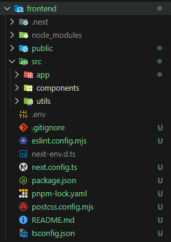

📝 Prompt Definitivo: Arquitectura Modular con Supabase & HttpOnly Cookies
Objetivo: Implementar un sistema de autenticación completo y seguro utilizando un stack Node.js/Express y Next.js, gestionando la autenticación de usuarios y base de datos con Supabase, y la sesión mediante HttpOnly Cookies. El proyecto debe seguir el principio de Separación de Responsabilidades a nivel de módulo/clase.

I. Estructura de Proyecto
El proyecto se dividirá en dos directorios principales (backend y frontend).

II. Backend (Node.js/Express) - Modular
El backend se enfocará únicamente en servir la API y proteger las rutas, delegando las verificaciones de autenticación a un servicio dedicado.

Herramientas Clave: express, jsonwebtoken, dotenv, cookie-parser.

Módulos de Responsabilidad:

server.js: Solo configuración inicial, middlewares globales y montaje de rutas.

./src/routes/authRoutes.js: Define la ruta de Logout y cualquier ruta de intercambio de tokens.

./src/services/authService.js: Contiene la lógica de verificación del JWT con Supabase (ej. llamando a supabase.auth.getUser()) y la gestión de cookies (establecer/eliminar).

./src/middleware/authMiddleware.js: Contiene la función que extrae la authToken de la cookie y llama a authService.verifyToken().

III. Frontend (Next.js) - Modular
El frontend se centrará en la UI y la interacción directa con el cliente de Supabase.

Herramientas Clave: Cliente de Supabase (@supabase/supabase-js).

Módulos de Responsabilidad:

./utils/supabase.js: Única inicialización del cliente Supabase.

./utils/api.js: Utilidad de fetch con credentials: 'include' para todas las llamadas al backend Express.

./components/AuthForm.js: Lógica de login y registro, usando supabase.auth.signInWithPassword() y supabase.auth.signUp(). No debe manejar cookies ni JWT.

./pages/dashboard.js: Maneja el ciclo de vida (llamada a la ruta protegida) y la redirección en caso de error 401/403.

./components/providers/AuthProvider.js: (Opcional pero recomendado) Contexto de React para gestionar el estado de "autenticado" en el cliente.

IV. Flujo Crítico de Autenticación
Login (Frontend): El usuario usa AuthForm.js para llamar a Supabase.

Respuesta Supabase: Supabase genera un JWT.

Intercambio de Token (CRÍTICO): Inmediatamente después del login exitoso, el Frontend debe enviar el JWT (devuelto por Supabase) a un endpoint de Express (ej., POST /auth/set-cookie).

Establecer Cookie (Backend): El authRoutes de Express recibe el JWT y lo establece como la HttpOnly Cookie (authToken).

Rutas Protegidas (Posterior): Todas las solicitudes subsiguientes incluyen la authToken. El authMiddleware extrae el token y el authService lo verifica con Supabase antes de dar acceso.

📁 Estructura de Carpetas Final con Responsabilidades
Esta estructura aísla las preocupaciones (UI, Enrutamiento, Servicios de Auth, Middlewares) en módulos específicos.

mi-proyecto-auth-modular/
├── backend/
│   ├── node_modules/
│   ├── .env                       # SUPABASE_URL, SUPABASE_KEY, JWT_SECRET
│   ├── src/
│   │   ├── services/
│   │   │   └── authService.js     # Lógica de verificación con Supabase y manejo de cookies
│   │   ├── middleware/
│   │   │   └── authMiddleware.js  # Extrae cookie y llama a authService.verify
│   │   └── routes/
│   │       └── authRoutes.js      # Rutas /auth/set-cookie, /auth/logout
│   ├── server.js                  # Inicialización Express y montaje de rutas
│   └── package.json
│
└── frontend/
    ├── node_modules/
    ├── pages/
    │   ├── login.js               # Usa AuthForm.js y maneja la redirección
    │   └── dashboard.js           # Página Protegida
    ├── components/
    │   └── AuthForm.js            # Lógica de Login/Registro con cliente Supabase
    ├── utils/
    │   ├── api.js                 # Cliente Fetch con credentials: 'include'
    │   └── supabase.js            # Inicialización del cliente Supabase
    ├── .env.local                 # Claves públicas de Supabase
    └── package.json

___________

# 🛠️ Fase 1: Backend (Node.js/Express con Supabase)

Nos centraremos en la carpeta backend/.

## Paso 1: Configuración Inicial
### 1. Crea la estructura de carpetas:
```
mkdir backend
cd backend
mkdir src
mkdir "src/services", "src/middleware", "src/routes"
npm init -y
```
### 2. Instala las dependencias:
```
pnpm install express jsonwebtoken dotenv cookie-parser @supabase/supabase-js body-parser
```
### 3. Crea el archivo .env:
```
# Claves de Supabase (las obtienes de tu proyecto Supabase -> Settings -> API)
SUPABASE_URL="https://[YOUR_PROJECT_REF].supabase.co"
SUPABASE_KEY="[YOUR_SUPABASE_SERVICE_ROLE_KEY]"

# Esta clave es solo para firmar el JWT que Supabase emite.
# NO la uses en el frontend. La obtenemos de Supabase -> Project Settings -> API -> JWT Secret.
SUPABASE_JWT_SECRET="[YOUR_SUPABASE_JWT_SECRET]" 

# Puerto del servidor
PORT=3000
```
_______


## Paso 2: Servicio de Autenticación (./src/services/authService.js)

Este módulo se encarga de toda la interacción con Supabase y la gestión de las HttpOnly Cookies, siguiendo el principio de Responsabilidad Única.
```
// ./src/services/authService.js

require('dotenv').config();
const { createClient } = require('@supabase/supabase-js');
const jwt = require('jsonwebtoken');

// 1. Inicialización de Supabase con clave de SERVICIO
// Usamos la Service Role Key para tener acceso de alto nivel para verificar tokens.
const supabase = createClient(
    process.env.SUPABASE_URL,
    process.env.SUPABASE_KEY
);

// Clave Secreta para verificar los tokens emitidos por Supabase
const SUPABASE_JWT_SECRET = process.env.SUPABASE_JWT_SECRET;

// Tiempo de expiración de la cookie (1 hora en ms, debe coincidir con el token de Supabase)
const COOKIE_MAX_AGE = 60 * 60 * 1000; 

/**
 * Verifica si un JWT es válido y obtiene los datos del usuario.
 * @param {string} token - El JWT de Supabase.
 * @returns {object} Los datos del payload del token si es válido.
 */
async function verifySupabaseToken(token) {
    if (!token) {
        throw new Error("No se proporcionó token.");
    }
    
    try {
        // Usamos jsonwebtoken para verificar la firma del token con la clave secreta de Supabase.
        const decoded = jwt.verify(token, SUPABASE_JWT_SECRET);
        
        // Opcional: Podrías hacer una verificación adicional llamando a Supabase aquí 
        // para asegurar que el usuario aún existe, pero verificar la firma ya es muy fuerte.
        
        return decoded;
    } catch (error) {
        // Token inválido o expirado
        throw new Error("Token inválido o expirado.");
    }
}

/**
 * Establece el token como una HttpOnly Cookie en la respuesta.
 * @param {object} res - Objeto de respuesta de Express.
 * @param {string} token - El JWT a establecer.
 */
function setAuthCookie(res, token) {
    res.cookie('authToken', token, {
        httpOnly: true,
        // En producción, debe ser 'true'. Aquí lo ajustamos según el entorno si es necesario.
        secure: process.env.NODE_ENV === 'production', 
        sameSite: 'strict',
        maxAge: COOKIE_MAX_AGE,
    });
}

/**
 * Elimina la HttpOnly Cookie de la respuesta.
 * @param {object} res - Objeto de respuesta de Express.
 */
function clearAuthCookie(res) {
    res.cookie('authToken', '', {
        httpOnly: true,
        expires: new Date(0), // Expira inmediatamente
        sameSite: 'strict',
    });
}

module.exports = {
    verifySupabaseToken,
    setAuthCookie,
    clearAuthCookie,
    supabase // Exportamos el cliente Supabase para otras interacciones si es necesario
};
```
__________

## Paso 3: Middleware de Autenticación (./src/middleware/authMiddleware.js)

Este módulo se encarga de extraer el token y usar el servicio para verificarlo.
```
// ./src/middleware/authMiddleware.js

const authService = require('../services/authService');

/**
 * Middleware para proteger rutas.
 * 1. Extrae el JWT de la HttpOnly Cookie.
 * 2. Verifica la validez del token usando authService.
 * 3. Adjunta los datos del usuario a req.user si es válido.
 */
async function authenticateToken(req, res, next) {
    // 1. Obtener el token de las cookies
    const token = req.cookies.authToken; 

    if (!token) {
        return res.status(401).json({ message: 'Acceso denegado. No se proporcionó token de sesión authMiddleware.js.' });
    }

    try {
        // 2. Verificar el token usando el servicio
        const userData = await authService.verifySupabaseToken(token);

        // 3. Adjuntar datos del usuario (el payload decodificado)
        req.user = userData;
        
        // Continuar con la ruta
        next(); 
    } catch (error) {
        // Token inválido o expirado
        console.error('Error de verificación de token:', error.message);
        authService.clearAuthCookie(res); // Limpia la cookie por seguridad si falla
        return res.status(403).json({ message: 'Sesión expirada o token inválido. Por favor, inicie sesión de nuevo.' });
    }
}

module.exports = {
    authenticateToken
};
```
_____

## Paso 4: Rutas de Autenticación (./src/routes/authRoutes.js)

Aquí definimos los endpoints que interactúan con el servicio y el middleware.
```
// ./src/routes/authRoutes.js

const express = require("express");
const router = express.Router();
const authService = require("../services/authService");
const { authenticateToken } = require("../middleware/authMiddleware");

// 1. RUTA DE INTERCAMBIO DE TOKEN (CRÍTICA)
// El frontend nos enviará el JWT que Supabase le dio.
// Nosotros lo establecemos como una HttpOnly Cookie.
router.post("/set-cookie", async (req, res) => {
  const { token } = req.body;

  if (!token) {
    return res
      .status(400)
      .json({ message: "Token requerido para establecer la cookie." });
  }

  try {
    // Opcional pero recomendado: verificar el token antes de establecerlo
    await authService.verifySupabaseToken(token);

    // Establecer la HttpOnly Cookie
    authService.setAuthCookie(res, token);

    res.json({ message: "Cookie de sesión establecida correctamente authRoutes.js." });
  } catch (error) {
    res
      .status(401)
      .json({ message: "Token inválido o error al establecer la cookie." });
  }
});

// 2. RUTA DE LOGOUT
router.post("/logout", async (req, res) => {
  // 1. Limpiar la cookie en la respuesta
  authService.clearAuthCookie(res);

  // 2. Opcional: Llama a la función de sign out de Supabase si fuera necesario
  //    (aunque la eliminación de la cookie y la expiración del token son suficientes)
  // await authService.supabase.auth.signOut();

  res.json({ message: "Sesión cerrada exitosamente." });
});

// 3. RUTA PROTEGIDA (ejemplo)
router.get("/perfil", authenticateToken, (req, res) => {
  // 1. Acceso Seguro al Rol usando Encadenamiento Opcional (?.):
  // El payload de Supabase NO tiene 'role' en el nivel raíz.
  // Buscamos 'user_role' (o 'role') dentro de app_metadata de forma segura.
  const userRole = req.user.app_metadata?.user_role || "default_user";

  // 2. Acceso Seguro a Propiedades Raíz:
  // Aseguramos que 'sub' (ID) y 'email' existen antes de usarlos.
  const userId = req.user?.sub;
  const userEmail = req.user?.email;

  // Si tu código tenía esta estructura original, el error estaba en la línea 53:
  /*
    const userRole = req.user.app_metadata 
                     ? (req.user.app_metadata.role || 'default_user') 
                     : 'default_user'; // Ocurre el error si 'app_metadata' es undefined
    */

  // --- Respuesta Final (Línea 53 corregida) ---
  res.json({
    message: "¡Acceso Concedido a la información privada!",
    userData: {
      id: userId,
      email: userEmail,
      role: userRole,
      // Si el error de 'role' persiste, temporalmente usa fullPayload
    },
    // Temporalmente, incluye el payload completo para que veas la estructura real
    // fullPayload: req.user
  });
});

module.exports = router;
```
________
## Paso 5: Servidor Principal (server.js)

Ensamblamos todas las partes.
```
// ./server.js

require('dotenv').config(); 
const express = require('express');
const bodyParser = require('body-parser');
const cookieParser = require('cookie-parser');
const authRoutes = require('./src/routes/authRoutes');

const app = express();
const port = process.env.PORT || 3000;

// Configuración de Middlewares
app.use(bodyParser.json());
app.use(cookieParser());

// Configuración de CORS (CRÍTICO para peticiones entre frontend y backend)
// En desarrollo, permitimos al frontend acceder. AJUSTA ESTO A TU DOMINIO REAL EN PROD.
app.use((req, res, next) => {
    // URL de tu frontend Next.js
    res.header('Access-Control-Allow-Origin', 'http://localhost:3001'); 
    res.header('Access-Control-Allow-Credentials', 'true');
    res.header('Access-Control-Allow-Headers', 'Content-Type, Authorization');
    res.header('Access-Control-Allow-Methods', 'GET, POST');
    next();
});


// Montar Rutas
app.use('/auth', authRoutes);
app.use('/api', authRoutes); // También montamos el perfil en /api

// Ruta de prueba
app.get('/', (req, res) => {
    res.send('Servidor Express de Autenticación funcionando.');
});

// Iniciar el Servidor
app.listen(port, () => {
    console.log(`Backend de Auth escuchando en http://localhost:${port}`);
    console.log(`¡Recuerda iniciar el Frontend en http://localhost:3001!`);
});
```

## Como debe de quedar el package.json
```
{
  "name": "backend",
  "version": "1.0.0",
  "main": "server.js",
  "scripts": {
    "dev": "node server.js",
    "test": "echo \"Error: no test specified\" && exit 1"
  },
  "keywords": [],
  "author": "",
  "license": "ISC",
  "description": "",
  "dependencies": {
    "@supabase/supabase-js": "^2.84.0",
    "body-parser": "^2.2.1",
    "cookie-parser": "^1.4.7",
    "dotenv": "^17.2.3",
    "express": "^5.1.0",
    "jsonwebtoken": "^9.0.2"
  }
}
```
___
# 🧪 Pruebas con Postman (Pre-Frontend)
Antes de pasar a Next.js, probaremos la Ruta Protegida y el Intercambio de Token.

Requisitos Previos en Supabase:

1. Asegúrate de tener un usuario registrado en tu proyecto Supabase (puedes registrar uno manualmente en la sección Authentication).

## Prueba 1: Fallo al Acceder a Ruta Protegida
1. Método: GET

2. URL: http://localhost:3000/api/perfil

3. Headers: Ninguno.

4. Resultado Esperado: Estado 401 Unauthorized.

## Prueba 2: Intercambio de Token (Simulando Login de Frontend)

1. Obtén un JWT de Supabase:

- Usa la API de Supabase o la consola para iniciar sesión. El JWT se te proporcionará después del login.

- Nota: Si usas el cliente de Supabase en un entorno de prueba, el token está en session.access_token.

2. Método: POST

3. URL: http://localhost:3000/auth/set-cookie

4. Headers:

- Content-Type: application/json

5. Body (raw JSON): Reemplaza TU_JWT_DE_SUPABASE por el token real.
```
JSON

{
    "token": "TU_JWT_DE_SUPABASE" 
}
```

6. Resultado Esperado: Estado 200 OK. Lo más importante: Postman ahora habrá guardado la authToken como una cookie.

## Prueba 3: Acceso Exitoso a Ruta Protegida

1. Método: GET

2. URL: http://localhost:3000/api/perfil

3. Headers: Ninguno (Postman adjuntará automáticamente la cookie del paso 2).

4. Resultado Esperado: Estado 200 OK y un JSON que muestra userData con la información del usuario.

Una vez que estas tres pruebas sean exitosas, el backend estará listo para interactuar con Next.js.

__________
__________
# 🚀 Paso 1: Inicializar el Proyecto Next.js

Asegúrate de estar ubicado dentro de la carpeta frontend/ en tu terminal.

1. Crea y navega a la carpeta: (Si aún no lo hiciste)
```
mkdir frontend
cd frontend
``` 
2. Ejecuta el comando de inicialización de Next.js: Usaremos create-next-app con el punto (.) para decirle que instale el proyecto en el directorio actual (que ya es frontend).
```
pnpm dlx create-next-app . --ts --eslint --app
```
- Nota: He añadido --ts (TypeScript), --eslint y --app (para usar el App Router, que es el estándar actual) ya que son las configuraciones modernas recomendadas, pero si prefieres JavaScript o Page Router, simplemente usa npx create-next-app ..

El instalador te hará algunas preguntas (ej. si deseas usar Tailwind CSS). Selecciona tus preferencias.
_________
## 🛠️ Paso 2: Instalación de Dependencias Adicionales
Una vez que Next.js haya terminado de inicializar los archivos base, instala las librerías específicas que usaremos para Supabase:
```
npm install @supabase/supabase-js
```
- Esto instala el cliente oficial de Supabase que usaremos para las funciones de autenticación (login/registro).
__________
## 🔑 Paso 3: Configuración del Entorno (.env.local)
Crea el archivo frontend/.env.local para almacenar las claves públicas y la URL de tu backend.
```
# .env.local

# Clave pública 'anon' de Supabase (la que se usa en el navegador, es segura)
NEXT_PUBLIC_SUPABASE_URL="https://kmvdpbplzshlkowysuti.supabase.co" 
NEXT_PUBLIC_SUPABASE_ANON_KEY="[TU_CLAVE_PÚBLICA_ANON_AQUÍ]" 

# URL de tu backend Express (para llamadas a la API)
NEXT_PUBLIC_EXPRESS_URL="http://localhost:3000"
```
____
# 📁 Estructura de Carpetas
Después de estos pasos, la estructura de tu proyecto de frontend se verá así (la carpeta app es del App Router de Next.js):
```
mi-proyecto-auth-modular/
└── frontend/
    ├── node_modules/
    ├── .env.local              <-- (Configuración de claves)
    ├── package.json
    ├── app/                    <-- (Carpeta de páginas de Next.js)
    ├── components/             <-- (Crear esta carpeta)
    └── utils/                  <-- (Crear esta carpeta)
```

_________
# 📝 Creación de Archivos del Frontend
Ahora que las carpetas existen, crearemos el código siguiendo la nueva ruta (src/utils y src/components).

## 1. ⚙️ Utilidades (dentro de frontend/src/utils/)

### 1.1. Cliente de Supabase (supabase.js)
```
// frontend/src/utils/supabase.js
import { createClient } from '@supabase/supabase-js';

const supabaseUrl = process.env.NEXT_PUBLIC_SUPABASE_URL;
const supabaseAnonKey = process.env.NEXT_PUBLIC_SUPABASE_ANON_KEY;

// Inicializa y exporta el cliente
export const supabase = createClient(supabaseUrl, supabaseAnonKey);
```
### 1.2. Utilidad API con Cookies (api.js)
```
// frontend/src/utils/api.js

const EXPRESS_URL = process.env.NEXT_PUBLIC_EXPRESS_URL;

/**
 * Función genérica para hacer llamadas a la API de Express, incluyendo cookies.
 */
export async function fetchApi(endpoint, options = {}) {
    
    const defaultOptions = {
        method: 'GET',
        headers: {
            'Content-Type': 'application/json',
        },
        // CRÍTICO: 'include' asegura que la cookie 'authToken' se envíe automáticamente.
        credentials: 'include', 
        ...options,
    };
    
    if (options.body && typeof options.body !== 'string') {
        defaultOptions.body = JSON.stringify(options.body);
    }

    const response = await fetch(`${EXPRESS_URL}${endpoint}`, defaultOptions);

    if (response.status === 401 || response.status === 403) {
        // Lanza un error para que el componente lo capture y redirija
        throw new Error('Sesión expirada o no válida. Redirigiendo a login.'); 
    }

    if (!response.ok) {
        const error = await response.json().catch(() => ({ message: 'Error de red/servidor' }));
        throw new Error(error.message || `Error ${response.status}`);
    }

    return response.json();
}
```
_________
## 2. ⚛️ Componente de Autenticación (dentro de frontend/src/components/)
### 2.1. Lógica de Autenticación (AuthForm.js)
```
// frontend/src/components/AuthForm.js

"use client";

import React, { useState } from 'react';
import { supabase } from '../utils/supabase';
import { fetchApi } from '../utils/api';
import { useRouter } from 'next/navigation'; // Usamos next/navigation para App Router

export default function AuthForm() {
    const [email, setEmail] = useState('');
    const [password, setPassword] = useState('');
    const [error, setError] = useState(null);
    const [isLogin, setIsLogin] = useState(true);
    const router = useRouter();

    // Este componente DEBE ser 'use client' si estás usando App Router (que es el default moderno)
    // Agrega 'use client' al principio del archivo si da error.
    
    const handleSubmit = async (e) => {
        e.preventDefault();
        setError(null);

        try {
            let authResponse;
            if (isLogin) {
                authResponse = await supabase.auth.signInWithPassword({ email, password });
            } else {
                authResponse = await supabase.auth.signUp({ email, password });
            }

            if (authResponse.error) {
                throw authResponse.error;
            }

            const token = authResponse.data.session?.access_token;
            
            if (token) {
                // 1. Intercambio de Token con Express (establece la HttpOnly Cookie)
                await fetchApi('/auth/set-cookie', {
                    method: 'POST',
                    body: { token }
                });
                
                // 2. Redirigir al dashboard
                router.push('/dashboard');
            }

        } catch (err) {
            console.error(err);
            setError(err.message || 'Error en la autenticación. Revisa email/contraseña.');
        }
    };

    return (
        <form onSubmit={handleSubmit}>
            <h2>{isLogin ? '🔑 Iniciar Sesión' : '📝 Crear Cuenta'}</h2>
            {error && <p style={{ color: 'red' }}>{error}</p>}
            
            <input type="email" value={email} onChange={(e) => setEmail(e.target.value)} placeholder="Email" required />
            <input type="password" value={password} onChange={(e) => setPassword(e.target.value)} placeholder="Contraseña" required />
            
            <button type="submit">{isLogin ? 'Entrar' : 'Registrar'}</button>
            
            <p onClick={() => setIsLogin(!isLogin)} style={{ cursor: 'pointer' }}>
                {isLogin ? '¿No tienes cuenta? Regístrate' : '¿Ya tienes cuenta? Inicia Sesión'}
            </p>
        </form>
    );
}
```
_____
## 3. 📄 Páginas de Next.js (dentro de frontend/src/app/)
### 3.1. Página de Login/Home (page.js)
```
// frontend/src/app/page.js
// Next.js App Router renderiza la ruta raíz (/)
import AuthForm from '../components/AuthForm';

// Hacemos que la página sea un cliente para usar el componente AuthForm
// Si tu archivo es JSX, añade 'use client' al inicio si usas App Router.
export default function HomePage() {
    return (
        <div style={{ padding: '20px', maxWidth: '400px', margin: 'auto' }}>
            <h1>Autenticación Segura</h1>
            <AuthForm />
        </div>
    );
}
```
### 3.2. Página Protegida (dashboard/page.js)
Crea la carpeta dashboard dentro de src/app para definir la ruta /dashboard
```
// frontend/src/app/dashboard/page.js
'use client'; // Necesario para usar hooks de React

import React, { useEffect, useState } from 'react';
import { fetchApi } from '@/utils/api'; // Usamos @/utils para importar desde src
import { useRouter } from 'next/navigation'; 

export default function Dashboard() {
    const [profileData, setProfileData] = useState(null);
    const [loading, setLoading] = useState(true);
    const router = useRouter();

    useEffect(() => {
        const fetchProfile = async () => {
            try {
                // 1. Llamada a Express: Envía la HttpOnly Cookie y verifica el JWT.
                const data = await fetchApi('/api/perfil');
                setProfileData(data.userData);
            } catch (error) {
                console.error('Error al obtener perfil:', error.message);
                // Si la sesión falla (401/403), redirigimos
                router.push('/'); 
            } finally {
                setLoading(false);
            }
        };

        fetchProfile();
    }, [router]);
    
    const handleLogout = async () => {
        try {
            // 2. Llama a Express para borrar la HttpOnly Cookie
            await fetchApi('/auth/logout', { method: 'POST' });
        } catch (error) {
            console.error('Error al cerrar sesión:', error);
        } finally {
            router.push('/');
        }
    };

    if (loading) return <p>Cargando datos del perfil...</p>;
    if (!profileData) return null;

    return (
        <div style={{ padding: '20px' }}>
            <h1>Panel de Control 🛡️</h1>
            <p>¡Bienvenido, **{profileData.email}**!</p>
            <p>Tu rol de sesión es: **{profileData.role}**</p>
            <button onClick={handleLogout}>Cerrar Sesión</button>
        </div>
    );
}
```
_________

